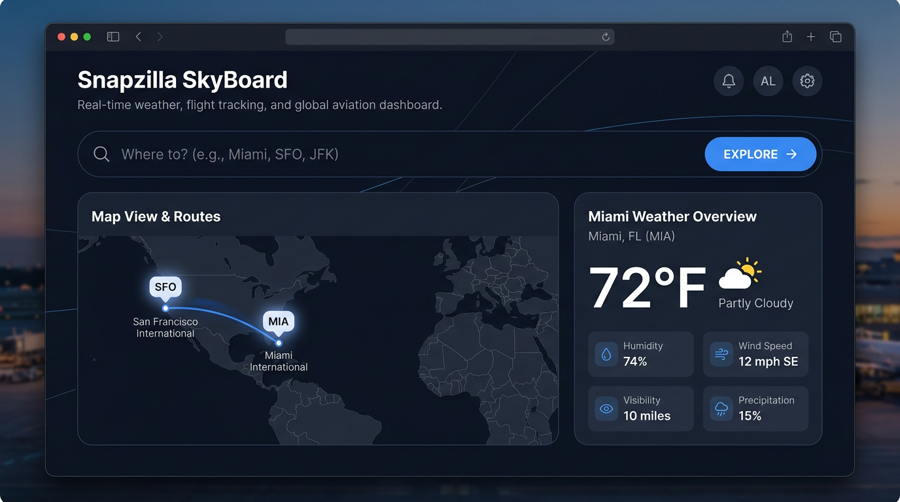
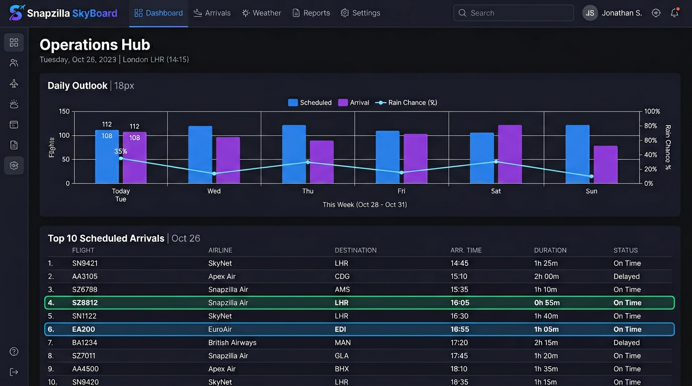

# Snapzilla SkyBoard

A simple travel dashboard: enter a **start city** and a **destination**, then see a **route map**, **weather at the destination**, a **multi-day outlook**, and up to **10 US-airline options** — **nonstop** between hubs first, then **one-stop** layovers if needed (the fastest total-time option is highlighted; **fares are not available** from the flight API).

## Projects

- **Snapzilla SkyBoard** (live) — [https://skyapp-tawny.vercel.app/](https://skyapp-tawny.vercel.app/)

---

## What you get

| Area | What it shows |
|------|----------------|
| **Search** | **From (start)** and **To (destination)** (e.g. `Chicago` → `Miami`), then **Explore**. |
| **Map** | Both city centers (**A** = start, **B** = destination) and a dashed guide line between them. |
| **Destination weather** | Temperature, “feels like,” humidity, wind, pressure, clouds, rain/snow for the **destination** only. |
| **Daily outlook** | Same destination; chart from OpenWeather’s free **3-hour forecast** (grouped by day; you may see fewer than 7 days). |
| **Flights** | Up to **10** rows, **US airlines only**: **nonstop** start hub → destination hub first; then **one-stop** (40min–16h layover). **Domestic**: if no match, other departures from the start hub may appear. **International**: short domestic hops from your city are hidden; instead the API may query **major U.S. gateways** (e.g. MIA, ATL) for nonstops **to your destination**, clearly labeled so times reflect the long-haul segment only. **Quickest** = shortest time among shown rows. |

---

## Screenshots

These images show the **layout and idea** of the app. You can swap the files in `docs/` for your own captures from a running build anytime.

### Overview (search, map, current weather)



### Forecast chart and flight list



---

## How it works (plain English)

1. **OpenWeather** geocodes **both** cities. Weather + forecast use the **destination** coordinates.  
2. Each city’s coordinates map to the **nearest major airport** in a built-in list (AviationStack’s airport **search** is paid-only on free plans).  
3. **AviationStack**: nonstop **start hub → destination hub** first; then **one-stop** via hub pairing. **Domestic** with no match: optional **other departures** from the start hub. **International** with no match: queries up to **four U.S. gateway airports** (by destination region) for nonstops **to the destination airport**—so you see plausible long-haul options, not 2-hour domestic legs. If gateways also return nothing, you get **travel guidance** only. **Fares** are not provided.

---

## Requirements

- **Node.js** (LTS recommended) — includes `npm`  
- Free API keys from **OpenWeather** and **AviationStack**

---

## Setup

### 1. Install packages

```bash
cd Weather-FlightDash
npm install
```

### 2. API keys

Copy the example env file and add your keys (Windows: `copy .env.example .env` · Mac/Linux: `cp .env.example .env`).

Edit `.env`:

| Variable | Where to get it |
|----------|------------------|
| `OPENWEATHER_API_KEY` | [OpenWeather API keys](https://home.openweathermap.org/api_keys) |
| `AVIATIONSTACK_ACCESS_KEY` | [AviationStack dashboard](https://aviationstack.com/dashboard) |

Optional: `PORT=8787` (API server port).

**Keep `.env` private** — it is listed in `.gitignore` and should not be committed.

---

## Run the app

**Development** (frontend + API together):

```bash
npm run dev
```

- Open the site: **http://localhost:5173**  
- The API runs at **http://localhost:8787** (Vite proxies `/api` to it).

**Production-style** (build static files, serve with Express):

```bash
npm run build
npm start
```

Then open **http://localhost:8787** (same server serves the UI and `/api`).

---

## Project layout (short)

| Path | Role |
|------|------|
| `src/` | React UI (Vite + TypeScript) |
| `server/index.js` | Express API proxy (hides API keys from the browser) |
| `server/airportLookup.js` | Nearest major airport from lat/lon |
| `server/data/major-airports.json` | Hub list used for matching |
| `docs/` | Screenshots for this README |

---

## Limits and tips

- **AviationStack free tier** has a **low monthly request cap**; heavy testing can hit the limit quickly.  
- **Flight list** depends on what the API returns **right now**; some airports or times may return few or no US-carrier rows.  
- **More airports:** add entries to `server/data/major-airports.json` (IATA, name, lat, lon, country code matching OpenWeather’s 2-letter country).

---

## License

Personal / learning use; respect OpenWeather and AviationStack terms of use for your API keys.
